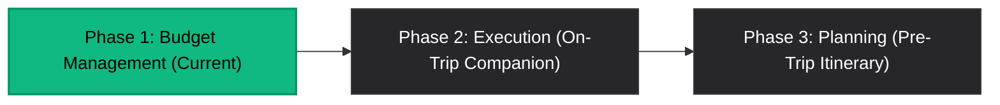

# BudgetControl - Trip Management 360 `v0.0.1`

**Version:** `v0.0.1`  
**Core Purpose:** Complete end-to-end **Trip Management 360** platform covering Planning, Execution, and Budget Management.  
**Current Milestone:** **Phase 1: Budget Management**.

A high-performance personal financial and travel management platform built with **React 19**, **Vite**, **Node.js (Express)**, and **Turso/libSQL (SQLite)**. It provides a modern dark-mode interface tailored for travel budget tracking, foreign exchange conversions, user authentication, and cross-platform mobile integration via Capacitor.

---

## 🗺️ Product Vision & Phase Roadmap

BudgetControl is built to empower travelers across the entire 360° travel lifecycle:



- **Phase 1: Budget Management (Active)**: Multi-currency expense tracking, live exchange rate conversions, category budget matrices, and secure user management.
- **Phase 2: Execution (Upcoming)**: Real-time itinerary tracking, location-based expense geofencing, and offline mobile sync.
- **Phase 3: Planning (Upcoming)**: AI-assisted itinerary planning, flight & hotel booking management, and interactive packing lists.

---

## 🚀 Bootstrap & Launch Instructions

Follow these step-by-step instructions to set up, initialize, and run the project locally.

### 1. Prerequisites
- **Node.js**: v18.0.0 or higher
- **npm**: v9.0.0 or higher

### 2. Installation
Clone the repository and install dependencies:
```bash
git clone https://github.com/igalepshtein/BudgetControl.git
cd BudgetControl
npm install
```

### 3. Initialize the Database
Run the database initialization script to create the local SQLite schema (`schema.sql`) and seed default data:
```bash
npm run db:init
```
*Note: The server automatically verifies and executes database migrations on boot.*

### 4. Start Development Server
Run the unified development command to launch the backend Express server alongside Vite HMR for the frontend:
```bash
npm run dev
```
Access the web application at:
- **Frontend App & API Proxy**: [http://localhost:3002](http://localhost:3002)

---

## ⚙️ Core Scripts & Commands

| Command | Description |
| :--- | :--- |
| `npm run dev` | Starts Express server (port 3001) and Vite frontend (port 3002) concurrently |
| `npm run build` | Compiles TypeScript and builds production bundle into `/dist` |
| `npm start` | Runs the production Express server |
| `npm test` | Runs Jest server and UI test suites sequentially (`--runInBand`) |
| `npm run db:init` | Reinitializes schema and seeds initial database state |
| `npx cap sync` | Syncs web build artifacts with native iOS/Android mobile wrappers |

---

## 🧪 Testing & Quality Assurance

All test suites reside in `/tests` and use SQLite database isolation (`TURSO_DATABASE_URL=file:test.db`):

```bash
npm test
```

- **Backend Integration Tests**: `/tests/server/` (`auth.test.ts`, `trips.test.ts`, `expenses.test.ts`, `currency.test.ts`, `server.test.ts`)
- **Validation Unit Tests**: `/tests/server/` (`auth_validation.test.ts`, `validation.test.ts`)
- **Frontend UI & Hook Tests**: `/tests/ui/` (`app.test.tsx`, `auth_view.test.tsx`, `dashboard.test.tsx`, `ledger.test.tsx`, `components.test.tsx`, `category_manage.test.tsx`, `hooks.test.tsx`)

---

## 📡 API Reference Overview

### 🔑 Authentication (`/api/auth`)
- `POST /api/auth/register` - Create user account (Pre-hashed Web Crypto SHA-256 password)
- `POST /api/auth/login` - Authenticate user & receive 30-day session token
- `POST /api/auth/logout` - Revoke active session token
- `GET /api/auth/me` - Fetch authenticated user profile

### 🧳 Trips (`/api/trips`)
- `GET /api/trips` - List trips owned by authenticated user
- `POST /api/trips` - Create trip & seed default categories
- `GET /api/trips/:id` - Fetch trip details, categories, and expenses
- `DELETE /api/trips/:id` - Cascade delete trip and associated data

### 💰 Expenses & Categories (`/api/expenses`)
- `POST /api/expenses` - Create expense & compute base currency amount
- `PUT /api/expenses/:id` - Update expense or custom exchange rate
- `DELETE /api/expenses/:id` - Delete expense record

### 💱 Currencies (`/api/currencies`)
- `GET /api/currencies/rate?from=EUR&to=USD` - Fetch live currency conversion rate

---

## 📚 Project Documentation

For deeper architectural breakdowns and feature specifications, explore the `/docs` directory:
- [Architecture & Design Guide](docs/ARCHITECTURE_DESIGN.md)
- [Current Features Specification](docs/CURRENT_FEATURES.md)
- [Release History](docs/RELEASE_HISTORY.md)
- [Development Status](docs/DEVELOPMENT_STATUS.md)

---

## 📄 License

MIT © BudgetControl 2026
