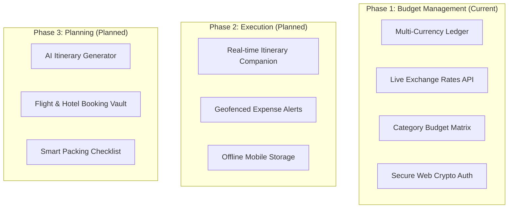
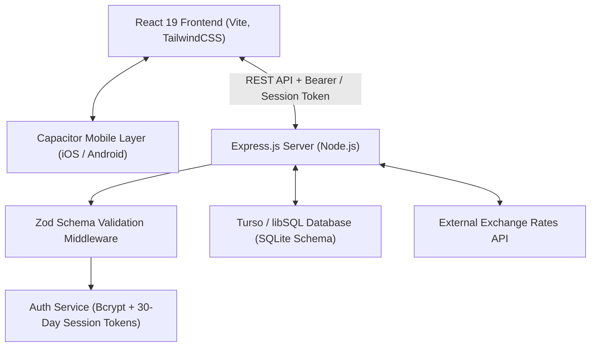
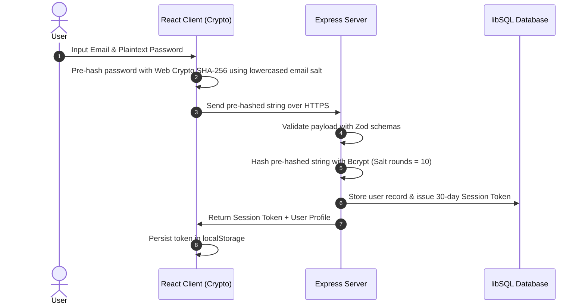
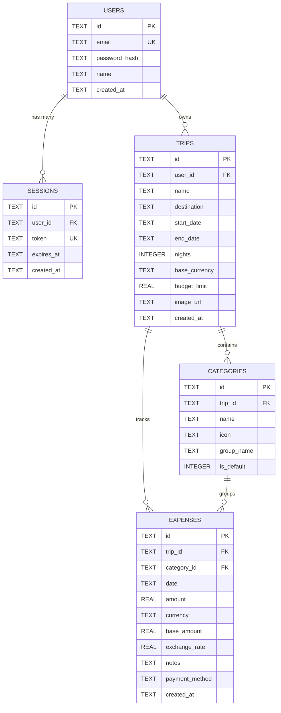

# BudgetControl - Architecture & System Design

This document details the architectural principles, component structure, data flows, database schemas, and security model of **BudgetControl** — a comprehensive **Trip Management 360** platform.

---

## 🗺️ 1. Product Lifecycle & Architectural Scope

BudgetControl is engineered as a 360-degree travel lifecycle system.

---

## 🏗️ 2. High-Level Architecture Overview

BudgetControl follows a unified full-stack architecture designed for high performance, strict type safety, zero-dependency client state management, and mobile cross-platform readiness.

---

## 🛡️ 3. Security & Authentication Architecture

BudgetControl uses a hybrid zero-knowledge client pre-hashing and server-side password storage pattern:

### Key Security Features
- **Client Pre-Hashing**: Web Crypto SHA-256 (`crypto.subtle.digest`) pre-hashes passwords using lowercased email as a unique salt before transmission.
- **Server Storage**: Server hashes incoming pre-hashed values with `bcryptjs` (salt factor 10).
- **Session Tokens**: 30-day cryptographically random session tokens stored in `sessions` table.
- **Type Safety**: Global Express Request augmentation (`req.userId`, `req.user`) enforced without type casting (`src/server/types/express.d.ts`).
- **Global Unauthorized Handler**: React `AuthProvider` listens for `budgetcontrol-unauthorized` window events to purge expired tokens automatically.

---

## 🗄️ 4. Database Schema Design (`schema.sql`)

The database uses Turso / libSQL (SQLite compatible) with automatic schema migration checks on startup.

---

## 🧱 5. Component Structure & React Patterns

The frontend adheres to Phase-based Component Decomposition:

- **Global Context**: `src/context/AuthContext.tsx` wraps `App.tsx` and provides authentication state to the entire app.
- **Custom Hooks**:
  - `src/hooks/useAuth.ts`: Consumes `AuthContext` with Vite Fast Refresh compatibility.
  - `src/hooks/useCurrencyRate.ts`: Handles dynamic currency exchange rate calculations with request cancellation (`AbortController`).
  - `src/hooks/useLedger.ts`: Manages transaction lists, memoized financial totals, and category breakdowns.
- **Modular Ledger Components**:
  - `src/components/ledger/ExpenseEntryForm.tsx`: Handles multi-currency expense entry.
  - `src/components/ledger/TransactionList.tsx`: Renders filterable transaction items with live rate editing.
  - `src/components/ledger/LedgerSummaryTable.tsx`: Visualizes budget limits vs actual spending matrix.

---

## ⚡ 6. Performance Optimizations

1. **Auto Migration Loader**: `src/server/loaders/db.ts` executes unconditional `ALTER TABLE` checks on server boot to guarantee zero downtime schema transitions.
2. **Parameterized SQL & Batching**: All queries use `?` parameter placeholders. Multi-statement operations use `db.batch` for atomic execution.
3. **Vite Fast Refresh Isolation**: React components and custom hooks are strictly separated across file boundaries to enable instant HMR updates.
